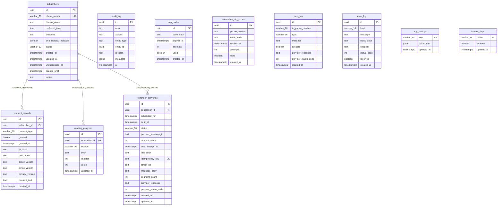

# מסד הנתונים — מיפוי טכני מלא

מסמך זה ממפה את שכבת הנתונים של Tanakh Backend כפי שהיא קיימת בפועל בקוד ובמיגרציות, נכון לתאריך כתיבת המסמך. כל טענה עוגנה בקובץ ובשורה קונקרטיים. במקומות שבהם לא נמצא מידע חד־משמעי בקוד — הדבר מצוין במפורש בסעיף האחרון ולא הוסק בניחוש.

## 1. מנוע מסד הנתונים וגרסתו

- **מנוע**: PostgreSQL, גרסה 16, תמונת דוקר `postgres:16-alpine` — `Backend/docker-compose.yml:3`.
- מדובר בסביבת הפיתוח המקומית (docker-compose). אין קובץ docker-compose לסביבות staging/production בריפו.
- עדות ל־PostgreSQL כמנוע היעד גם בפרוביידר ה-EF Core: `Npgsql.EntityFrameworkCore.PostgreSQL` גרסה `10.0.3` — `Backend/Tanakh.Infrastructure/Tanakh.Infrastructure.csproj:20`.
- **production / staging**: בקוד התשתית (לא רק בתיעוד) יש עדות מפורשת לכך שהיעד המיועד הוא **Neon** (PostgreSQL מנוהל):
  - `Backend/db/dumps/pg_dump.sh:3` — "Neon's own point-in-time restore is the primary/fast recovery path".
  - `Backend/db/roles/migrations_user.sql:6-8` — הערה על תפקיד ה-owner שמספק Neon כברירת מחדל.
  - `.github/workflows/backend-backup.yml:4-12` — workflow יומי שמצפה ל-secret בשם `DIRECT_DATABASE_URL`, ומצהיר במפורש: *"not yet configured, since no Neon project exists for this app yet... this workflow will fail at the 'Take backup' step; that's expected"*.
  - **מסקנה עובדתית**: נכון לרגע זה, **אין עדיין פרויקט Neon מסופק בפועל** עבור staging/production — התשתית (workflow, סקריפט גיבוי, roles) בנויה סביב Neon אך לא חוברה למופע אמיתי. זהו ממצא רלוונטי לקראת עלייה לאוויר.
  - קובץ `docs/database.md:14-15` (קריאה בלבד, לא מקור אימות עצמאי) מתאר את אותה כוונה — Neon כפרויקט/branch נפרד לכל סביבה — אך אין בריפו קובץ קונפיגורציה בפועל (למשל appsettings.Production.json) שמאשר זאת, ראו סעיף "לא ידוע" בתחתית.

### מאגר נתונים נוסף: מטמון בזיכרון (In-Memory Cache) — לא Redis

בבדיקת `Backend/Tanakh.Infrastructure/Caching` ו-`Backend/Tanakh.Domain/Caching` נמצא מטמון פנים-תהליכי (in-process) בלבד, לא Redis ולא מאגר חיצוני:

- ממשק `ITanakhCache` — `Backend/Tanakh.Domain/Caching/ITanakhCache.cs:5-10`.
- מימוש `MemoryTanakhCache`, עוטף `Microsoft.Extensions.Caching.Memory.IMemoryCache` — `Backend/Tanakh.Infrastructure/Caching/MemoryTanakhCache.cs:9-24`, זמן תפוגה קבוע של 12 שעות (`MemoryTanakhCache.cs:15`).
- נרשם כ-Singleton ב-DI: `Backend/Tanakh.Api/Program.cs:57` (`AddSingleton<ITanakhCache, MemoryTanakhCache>`), עם `AddMemoryCache` בעל מגבלת גודל 100 — `Program.cs:53-56`.
- שימוש: `CacheProvider` (`Backend/Tanakh.Infrastructure/CacheProvider.cs:16-101`) משתמש בו כדי לשמור בזיכרון את תוכן קובצי ה-JSON הסטטיים `TanakhData.json`/`TanakhStructure.json` (טקסט התנ"ך והמבנה שלו) — לא נתוני משתמשים/מנויים.
- `AppSettingsService` (`Backend/Tanakh.Infrastructure/Services/AppSettingsService.cs:17,31,54`) משתמש ב-`IMemoryCache` ישירות (לא דרך `ITanakhCache`) כדי לשים במטמון למשך 5 דקות (`AppSettingsService.cs:17`) את שורות ה-`app_settings` (maintenance/banner) שנקראות בכל בקשה כמעט (middleware ב-`Program.cs:262-284`).
- לא נמצאה כל התייחסות ל-Redis או ל-`IDistributedCache` בקוד (חיפוש גורף בכל `Backend` החזיר 0 תוצאות).

## 2. מנגנון החיבור

- **ORM/דרייבר**: EF Core (`Microsoft.EntityFrameworkCore.Relational` 10.0.10) + פרוביידר `Npgsql.EntityFrameworkCore.PostgreSQL` 10.0.3 — `Backend/Tanakh.Infrastructure/Tanakh.Infrastructure.csproj:9,20`. מוסכמת שמות snake_case מיושמת דרך `EFCore.NamingConventions` 10.0.1 (`Tanakh.Infrastructure.csproj:8`) ומופעלת בפועל ב-`options.UseSnakeCaseNamingConvention()` — `Backend/Tanakh.Api/Program.cs:45` ובמפעל העיצוב `Backend/Tanakh.Infrastructure/Data/AppDbContextFactory.cs:22`.
- **הגדרת ה-DbContext**: `AppDbContext` — `Backend/Tanakh.Infrastructure/Data/AppDbContext.cs:11-80`. מכיל 11 `DbSet`ים (שורות 20-40), ומחיל את כל קונפיגורציות ה-Fluent API מה-assembly באמצעות `ApplyConfigurationsFromAssembly` — `AppDbContext.cs:44`. בנוסף, `SaveChanges`/`SaveChangesAsync` מבוטלים (override) כדי להטביע אוטומטית `CreatedAt`/`UpdatedAt` על ישויות שמממשות `IHasCreatedAt`/`IHasUpdatedAt` — `AppDbContext.cs:47-78`.
- **רישום ב-DI**: `builder.Services.AddDbContextPool<AppDbContext>(...)` — `Backend/Tanakh.Api/Program.cs:35-51`. שימוש ב-connection pooling ברמת EF Core (`AddDbContextPool`, לא `AddDbContext` רגיל), עם `EnableRetryOnFailure()` ו-`CommandTimeout(30)` שניות — `Program.cs:42-43`. ב-Development מופעל `EnableSensitiveDataLogging()` — `Program.cs:47-50`.
- **חיבור בזמן עיצוב (migrations)**: `AppDbContextFactory` — `Backend/Tanakh.Infrastructure/Data/AppDbContextFactory.cs:12-27`, מממש `IDesignTimeDbContextFactory<AppDbContext>`. עוקף במכוון את ה-host של ASP.NET Core (`AppDbContextFactory.cs:8-11`) וקורא ישירות מ-`Environment.GetEnvironmentVariable("ConnectionStrings__MigrationsDb")` — שורה 16.
- **מפתחות ה-connection string** (שמות בלבד, ללא ערכים):
  - `ConnectionStrings:AppDb` — נקרא ב-`Program.cs:37` דרך `builder.Configuration.GetConnectionString("AppDb")`. ערך `[REDACTED]`.
  - `ConnectionStrings:MigrationsDb` — נקרא ב-`AppDbContextFactory.cs:16` (כמשתנה סביבה `ConnectionStrings__MigrationsDb`) ובנוסף ב-`Backend/Tanakh.Infrastructure/Seeding/DatabaseSeeder.cs:28` (`configuration.GetConnectionString("MigrationsDb")`, בתוך `ResetSchemaAsync` — פעולת פיתוח בלבד, ראו סעיף 8). ערך `[REDACTED]`.
  - קובץ הדוגמה `Backend/.env.example:15-16` מציג את שתי משתני הסביבה (`ConnectionStrings__AppDb`, `ConnectionStrings__MigrationsDb`) עם משתמשים שונים — `app_user` ו-`migrations_user` בהתאמה — אך ערכי הדוגמה שם הם placeholder-ים (`changeme`), לא סודות אמיתיים.
  - `Backend/Tanakh.Api/appsettings.json:1-10` ו-`appsettings.Development.json` אינם מכילים מפתח `ConnectionStrings` כלל — כלומר אין ברירת מחדל מוטמעת בקובץ קונפיגורציה; שתי מחרוזות החיבור מגיעות אך ורק ממשתני סביבה.
- **תפקידי DB** (roles, ללא ערכי סיסמה): `Backend/db/roles/migrations_user.sql` יוצר תפקיד `migrations_user` שהוא ה-owner של הסכימה `public` (שורה 32) ומבטל הרשאת `CREATE` מ-`PUBLIC` (שורה 35). `Backend/db/roles/app_user.sql` קיים אף הוא באותה תיקייה (לא נקרא לעומק לפי הנחיית המשימה, אינו מכיל סודות בשמו).
- **אתחול תוסף DB**: `Backend/db/init/01-extensions.sql:3` — `CREATE EXTENSION IF NOT EXISTS citext;`, רץ אוטומטית ב-container הראשון של postgres דרך `docker-entrypoint-initdb.d` (`Backend/docker-compose.yml:15`). ההערה בקובץ (`01-extensions.sql:2`) אומרת *"citext backs subscribers.email"* — אך בסכימה הנוכחית (ראו סעיף 3.1) לישות `Subscriber` **אין** עמודת `email` כלל; היא הוסרה במיגרציה `SmsReminders` (`Backend/Tanakh.Infrastructure/Migrations/20260805180219_SmsReminders.cs:36-37,43-44`) כשהמוצר עבר מהתראות אימייל להתראות SMS. כלומר קובץ האתחול מתייחס לעמודה שכבר לא קיימת בסכימה הנוכחית — עובדה מתועדת, לא המלצה.

## 3. טבלאות (Entities) — מיפוי מלא

מקור האמת לסכימה הנוכחית: `Backend/Tanakh.Infrastructure/Migrations/AppDbContextModelSnapshot.cs` (קובץ ה-snapshot המצטבר, `BuildModel`, שורות 16-653). לכל טבלה מובא גם קובץ הקונפיגורציה הרלוונטי תחת `Backend/Tanakh.Infrastructure/Data/Configurations/` וקובץ הישות תחת `Backend/Tanakh.Domain/Entities/`.

### 3.1 `subscribers`

**מייצג**: אדם שנרשם לקבלת תזכורות SMS יומיות לקריאת פרק בתנ"ך. שורה אחת לכל מנוי (מזוהה לפי מספר טלפון ולא לפי חשבון/סיסמה — אין מנגנון login למנויים, יש "manage token" חתום).

מקור: `Backend/Tanakh.Domain/Entities/Subscriber.cs:6-40`, קונפיגורציה `Backend/Tanakh.Infrastructure/Data/Configurations/SubscriberConfiguration.cs:8-70`, סכימה `AppDbContextModelSnapshot.cs:491-569`.

| שדה (עמודה) | סוג נתונים | חובה/nullable | ברירת מחדל | מפתח | הערה |
|---|---|---|---|---|---|
| `id` (Id) | uuid | חובה | נוצר ב-C# (`Guid.CreateVersion7()`), לא ב-DB (`ValueGeneratedNever` — `SubscriberConfiguration.cs:33-34`) | PK (`pk_subscribers`) | UUID v7, ניתן למיון כרונולוגית |
| `phone_number` (PhoneNumber) | character varying(20) | **nullable** | — | ייחודי (`ix_subscribers_phone_number`) | E.164; nullable רק כדי לאפשר אנונימיזציה (ראו `Subscriber.cs:12-16`) |
| `display_name` (DisplayName) | text | nullable | — | — | שם תצוגה חופשי |
| `preferred_time` (PreferredTime) | time without time zone | חובה | — | — | שעת שליחת התזכורת המועדפת |
| `timezone` (Timezone) | text | חובה | `'Asia/Jerusalem'` | — | IANA zone id |
| `skip_shabbat_holidays` (SkipShabbatHolidays) | boolean | חובה | `true` | — | האם לדלג על שבת/חג |
| `status` (Status) | character varying(32) | חובה | — | — | `active` / `unsubscribed` בלבד (`ck_subscribers_status`) |
| `created_at` (CreatedAt) | timestamp with time zone | חובה | `now()` (DB-side) | — | |
| `updated_at` (UpdatedAt) | timestamp with time zone | חובה | מוטבע ע"י `AppDbContext.StampAuditTimestamps` (`AppDbContext.cs:59-77`), לא ברירת מחדל ב-DB | — | |
| `unsubscribed_at` (UnsubscribedAt) | timestamp with time zone | nullable | — | — | |
| `paused_until` (PausedUntil) | timestamp with time zone | nullable | — | — | השהיית תזכורות זמנית |
| `locale` (Locale) | text | חובה | `'he-IL'` | — | |

אילוצי בדיקה (Check constraints): `ck_subscribers_status`, `ck_subscribers_timezone_not_empty`, `ck_subscribers_phone_required_when_active` (טלפון חובה כשה-status הוא `active`) — `AppDbContextModelSnapshot.cs:563-567`, מוגדרים ב-`SubscriberConfiguration.cs:14-27`.

**כותבים (INSERT/UPDATE/DELETE)**:
- `Backend/Tanakh.Infrastructure/Services/SubscriptionService.cs:132` — יצירת מנוי חדש (`AddAsync`), נקרא מ-`POST /api/v1/subscriptions` — `Backend/Tanakh.Api/Controllers/SubscriptionsController.cs:95`.
- `SubscriptionService.cs:144-152` — עדכון בעת הרשמה חוזרת (resubscribe) על אותו נתיב.
- `SubscriptionService.cs:172-174` (`UnsubscribeAsync`) — עדכון `status`/`unsubscribed_at`/`paused_until`, נקרא מ-`POST /api/v1/subscriptions/me/unsubscribe` (`SubscriptionsController.cs:158`) וגם מ-`AdminService.UnsubscribeByPhoneAsync` (`Backend/Tanakh.Infrastructure/Services/AdminService.cs:96`) שנקרא מ-`POST /api/v1/admin/actions/unsubscribe` (`Backend/Tanakh.Api/Controllers/AdminController.cs:28`) ומ-`AdminService.BlockUserAsync` (`AdminService.cs:197`) שנקרא מ-`PATCH /api/v1/admin/users/{id}` action=block (`Backend/Tanakh.Api/Controllers/AdminUsersController.cs:47`).
- `SubscriptionService.cs:198-199` (`ReactivateAsync`) — נקרא מ-`AdminService.UnblockUserAsync` (`AdminService.cs:209`), דרך `PATCH /api/v1/admin/users/{id}` action=unblock (`AdminUsersController.cs:48`).
- `SubscriptionService.cs:239-254` (`UpdatePreferencesAsync`) — עדכון `preferred_time`/`skip_shabbat_holidays`/`paused_until`, נקרא מ-`POST /api/v1/subscriptions/me` (`SubscriptionsController.cs:143`).
- `Backend/Tanakh.Infrastructure/Services/SubscriberAnonymizationService.cs:33-34` — איפוס `phone_number`/`display_name` ל-NULL (אנונימיזציה, לא מחיקה פיזית). נקרא מ-`AdminService.DeleteUserAsync` (`AdminService.cs:231`) דרך `DELETE /api/v1/admin/users/{id}` (`AdminUsersController.cs:64`), וגם אוטומטית מ-`RetentionHostedService.AnonymizeExpiredSubscribersAsync` (`Backend/Tanakh.Infrastructure/Retention/RetentionHostedService.cs:128`, batch job מתוזמן).
- `Backend/Tanakh.Infrastructure/Seeding/DatabaseSeeder.cs:59` — נתוני seed לפיתוח בלבד (ראו סעיף 9).

**קוראים (SELECT)**:
- `SubscriptionService.cs:121-122,162-163,186-187,206-207,227-228` — חיפוש מנוי לפי טלפון/מזהה בכל אחד מנתיבי `SubscriptionsController`.
- `Backend/Tanakh.Infrastructure/Services/AdminService.cs:45-46,49,55,71,88-89,124-129,192,204,216,363` — סטטיסטיקות דשבורד ורשימת משתמשים, נקרא מ-`AdminStatsController` (`Backend/Tanakh.Api/Controllers/AdminStatsController.cs:29`), `AdminUsersController.cs:36`, `AdminController.cs:28,35`.
- `Backend/Tanakh.Infrastructure/Retention/RetentionHostedService.cs:116` — שאילתת batch לזיהוי מנויים לאנונימיזציה.
- `Backend/Tanakh.Infrastructure/Reminders/ReminderPlannerService.cs:73` — שליפת מנויים פעילים לתכנון תזכורות יומי.
- `Backend/Tanakh.Infrastructure/Reminders/ReminderDispatcherService.cs:123` — שליפת המנוי בעת עיבוד כל תזכורת לשליחה.
- `Backend/Tanakh.Infrastructure/Services/SubscriberAnonymizationService.cs:22` — לפני האנונימיזציה עצמה.

### 3.2 `reading_progress`

**מייצג**: המיקום הנוכחי (ספר/פרק/פסוק) שמנוי הגיע אליו בכל אחד משלושת חלקי התנ"ך (תורה/נביאים/כתובים) — שורה אחת פר (מנוי, חלק).

מקור: `Backend/Tanakh.Domain/Entities/ReadingProgress.cs:9-24`, קונפיגורציה `Backend/Tanakh.Infrastructure/Data/Configurations/ReadingProgressConfiguration.cs:8-44`, סכימה `AppDbContextModelSnapshot.cs:291-339`.

| שדה | סוג | חובה/nullable | ברירת מחדל | מפתח | הערה |
|---|---|---|---|---|---|
| `id` | uuid | חובה | נוצר ב-C# | PK (`pk_reading_progress`) | |
| `subscriber_id` | uuid | חובה | — | FK → `subscribers.id` | |
| `section` | character varying(16) | חובה | — | חלק מאינדקס ייחודי | `torah`/`neviim`/`ketuvim` בלבד (`ck_reading_progress_section`) |
| `book` | text | חובה | — | — | |
| `chapter` | integer | חובה | — | — | `>= 1` (`ck_reading_progress_chapter`) |
| `verse` | integer | nullable | — | — | `NULL` או `>= 1` (`ck_reading_progress_verse`) |
| `updated_at` | timestamp with time zone | חובה | — | — | |

אינדקס ייחודי: `(subscriber_id, section)` — `ix_reading_progress_subscriber_id_section`, `AppDbContextModelSnapshot.cs:327-329`.

**כותבים**:
- `Backend/Tanakh.Infrastructure/Services/ReadingProgressService.cs:36` (הוספה) ו-`:48-50` (עדכון) בתוך `UpsertProgressAsync` — נקרא מ-`POST /api/v1/reading-progress` (`Backend/Tanakh.Api/Controllers/ReadingProgressController.cs:52`).
- `Backend/Tanakh.Infrastructure/Seeding/DatabaseSeeder.cs:61` — נתוני seed לפיתוח בלבד.

**קוראים**:
- `ReadingProgressService.cs:24` (`GetProgressAsync`) — נקרא מ-`Backend/Tanakh.Infrastructure/Services/NextChapterResolver.cs:34`. **לא נמצא אף קורא (caller) ל-`INextChapterResolver` בקוד האפליקציה עצמו** מלבד הרישום ב-DI (`Backend/Tanakh.Api/Program.cs:68`) והמימוש/הטסטים — חיפוש גורף בכל `Backend` לא העלה שום controller/service שמזריק את הממשק ומשתמש בו בפועל. בפרט, ה-SMS שנשלח בפועל (`Backend/Tanakh.Infrastructure/Reminders/ReminderDispatcherService.cs:196-203`) בונה קישור קבוע מ-`options.PublicBaseUrl` ולא דרך `NextChapterResolver`.
- `Backend/Tanakh.Infrastructure/Services/AdminService.cs:134-138` — חישוב "משתמשים פעילים" לסטטיסטיקת overview (`GET /api/v1/admin/stats/overview`, `Backend/Tanakh.Api/Controllers/AdminStatsController.cs:29`).

### 3.3 `reminder_deliveries`

**מייצג**: שורה אחת פר ניסיון תזכורת מתוזמן/שנשלח למנוי (idempotent per subscriber+scheduled_for).

מקור: `Backend/Tanakh.Domain/Entities/ReminderDelivery.cs:11-67`, קונפיגורציה `Backend/Tanakh.Infrastructure/Data/Configurations/ReminderDeliveryConfiguration.cs:8-62`, סכימה `AppDbContextModelSnapshot.cs:341-436`.

| שדה | סוג | חובה/nullable | ברירת מחדל | מפתח | הערה |
|---|---|---|---|---|---|
| `id` | uuid | חובה | נוצר ב-C# | PK (`pk_reminder_deliveries`) | |
| `subscriber_id` | uuid | חובה | — | FK → `subscribers.id`; חלק מאינדקס ייחודי | |
| `scheduled_for` | timestamp with time zone | חובה | — | חלק מאינדקס ייחודי | |
| `sent_at` | timestamp with time zone | nullable | — | — | |
| `status` | character varying(16) | חובה | — | חלק מאינדקס | `pending`/`sending`/`sent`/`failed`/`skipped` (`ck_reminder_deliveries_status`) |
| `provider_message_id` | text | nullable | — | — | קיים בסכימה מאז המיגרציה הראשונה, **לא נמצא אף מקום בקוד שכותב לשדה זה** (ראו הערה) |
| `attempt_count` | integer | חובה | `0` | — | |
| `next_attempt_at` | timestamp with time zone | nullable | — | — | |
| `last_error` | text | nullable | — | — | |
| `idempotency_key` | text | חובה | — | ייחודי (`ix_reminder_deliveries_idempotency_key`) | `SHA256(subscriberId:scheduledFor)`, `ReminderDelivery.ComputeIdempotencyKey` (`ReminderDelivery.cs:60-65`) |
| `target_url` | text | nullable | — | — | |
| `message_body` | text | nullable | — | — | טקסט ה-SMS בפועל שנשלח |
| `segment_count` | integer | nullable | — | — | מספר מקטעי SMS שחויבו בפועל |
| `provider_response` | text | nullable | — | — | תגובת SMS4FREE גולמית |
| `provider_status_code` | integer | nullable | — | — | קוד סטטוס של SMS4FREE |
| `created_at` | timestamp with time zone | חובה | `now()` | — | |
| `updated_at` | timestamp with time zone | חובה | — | — | |

אינדקסים: ייחודי על `idempotency_key`; ייחודי על `(subscriber_id, scheduled_for)`; לא-ייחודי על `(status, scheduled_for)` — `AppDbContextModelSnapshot.cs:421-430`.

**כותבים**:
- הוספה גולמית (raw SQL עם `ON CONFLICT ... DO NOTHING`, לא דרך `DbSet.Add`) ב-`Backend/Tanakh.Infrastructure/Reminders/ReminderPlannerService.cs:105-111` (ריצה יומית/startup) וב-`Backend/Tanakh.Infrastructure/Services/SubscriptionService.cs:276-282` (תכנון מיידי אחרי שינוי העדפות).
- עדכון סטטוס ל-`Skipped` בביטול: `SubscriptionService.cs:177-179` (`ExecuteUpdateAsync`), ב-`UnsubscribeAsync`.
- מחיקת שורות pending בעדכון העדפות: `SubscriptionService.cs:262-264` (`ExecuteDeleteAsync`).
- `Backend/Tanakh.Infrastructure/Reminders/ReminderDispatcherService.cs:128,135,144,151-163,171-172,185-187,191-192` — עדכון שדות המשלוח (status/sent_at/provider_response/וכו') בתוך `ProcessDeliveryAsync`, וכן `ReapStuckSendingRowsAsync` (raw SQL UPDATE, שורות 207-211) ו-`ClaimDueDeliveriesAsync` (raw SQL UPDATE...RETURNING, שורות 216-231) — כולם רצים כ-`BackgroundService`, לא דרך HTTP endpoint.
- `Backend/Tanakh.Infrastructure/Services/AdminService.cs:105-113` (`RequeueFailedDeliveryAsync`, `ExecuteUpdateAsync`) — נקרא מ-`POST /api/v1/admin/actions/requeue` (`Backend/Tanakh.Api/Controllers/AdminController.cs:35`).
- `Backend/Tanakh.Infrastructure/Retention/RetentionHostedService.cs:67-71` — מחיקת batch של שורות ישנות (`ExecuteDeleteAsync`).
- `Backend/Tanakh.Infrastructure/Seeding/DatabaseSeeder.cs:78` — נתוני seed לפיתוח בלבד.

**קוראים**:
- `AdminService.cs:50-51,53-58,69-75,105-106` — נקרא מ-`AdminController`/`AdminStatsController`.
- `ReminderDispatcherService.cs:83-85` — שליפת השורות שנתפסו (claimed) לעיבוד.
- `SubscriptionService.cs:177-179,262-264` (השאילתה בתוך ה-`ExecuteUpdateAsync`/`ExecuteDeleteAsync` עצמם, אין SELECT נפרד).

### 3.4 `consent_records`

**מייצג**: רשומת הוכחה משפטית (תיקון 13 לחוק הגנת הפרטיות) שמנוי נתן הסכמה — טבלת **append-only**, נאכף ברמת ה-DB.

מקור: `Backend/Tanakh.Domain/Entities/ConsentRecord.cs:6-42`, קונפיגורציה `Backend/Tanakh.Infrastructure/Data/Configurations/ConsentRecordConfiguration.cs:8-64`, סכימה `AppDbContextModelSnapshot.cs:98-168`, אכיפת append-only: `Backend/Tanakh.Infrastructure/Migrations/20260730143807_ConsentRecords.cs:45-59` (טריגר PL/pgSQL `trg_consent_records_append_only` שזורק exception על UPDATE/DELETE).

| שדה | סוג | חובה/nullable | ברירת מחדל | מפתח | הערה |
|---|---|---|---|---|---|
| `id` | uuid | חובה | נוצר ב-C# | PK (`pk_consent_records`) | |
| `subscriber_id` | uuid | חובה | — | FK → `subscribers.id` (Restrict) | |
| `consent_type` | character varying(16) | חובה | — | חלק מאינדקס | `marketing`/`analytics`/`functional` (`ck_consent_records_consent_type`) |
| `granted` | boolean | חובה | — | — | |
| `granted_at` | timestamp with time zone | חובה | — | חלק מאינדקס | |
| `ip_hash` | text | חובה | — | — | HMAC של כתובת ה-IP (`IHashingService`) |
| `user_agent` | text | חובה | — | — | |
| `policy_version` | text | חובה | — | — | קבוע `ConsentPolicyVersion = "2026-07-30"` (`SubscriptionService.cs:16`) |
| `terms_version` | text | חובה | `''` (ברירת מחדל שהוגדרה במיגרציית ההוספה, `AddConsentVersionColumns.cs:27-32`, לא מוגדרת ברמת Fluent API הנוכחית) | — | |
| `privacy_version` | text | חובה | `''` (ראו לעיל) | — | |
| `consent_text` | text | חובה | `''` (ראו לעיל) | — | |
| `created_at` | timestamp with time zone | חובה | `now()` | — | |

אינדקס: `(subscriber_id, consent_type, granted_at)` — לא ייחודי (מותר ריבוי רשומות, בהתאם לאופי append-only).

**כותבים**:
- `Backend/Tanakh.Infrastructure/Services/SubscriptionService.cs:292` (`RecordConsentAsync`, `AddAsync`) — נקרא מתוך `SubscribeAsync` (`SubscriptionService.cs:154`), כלומר מ-`POST /api/v1/subscriptions` (`SubscriptionsController.cs:95`). **זהו המקום היחיד בכל הקוד שכותב לטבלה זו.**

**קוראים**: **לא נמצא אף מקום בקוד האפליקציה שקורא (SELECT) מטבלה זו** — חיפוש גורף אחר `.ConsentRecords` החזיר רק את קובץ הכתיבה לעיל. אין endpoint שמציג היסטוריית הסכמות.

### 3.5 `audit_log`

**מייצג**: יומן פעולות רגישות (התחברות אדמין, פעולות אדמין על משתמשים, שינויי הגדרות מערכת) — טבלת **append-only**, נאכף ברמת ה-DB.

מקור: `Backend/Tanakh.Domain/Entities/AuditLogEntry.cs:5-30` (`entity_id`/`entity_type` הם רפרנס רופף/פולימורפי, **לא** FK אמיתי — ראו הערה בקובץ שורות 8-10), קונפיגורציה `Backend/Tanakh.Infrastructure/Data/Configurations/AuditLogEntryConfiguration.cs:9-40`, סכימה `AppDbContextModelSnapshot.cs:47-96`, אכיפת append-only: `Backend/Tanakh.Infrastructure/Migrations/20260730144124_AuditLog.cs:44-57`.

| שדה | סוג | חובה/nullable | ברירת מחדל | מפתח | הערה |
|---|---|---|---|---|---|
| `id` | uuid | חובה | נוצר ב-C# | PK (`pk_audit_log`) | |
| `actor` | text | חובה | — | — | ערך חופשי, למשל `"admin"` |
| `action` | text | חובה | — | — | למשל `"admin.login.success"` |
| `entity_type` | text | חובה | — | — | רפרנס רופף, לא FK |
| `entity_id` | uuid | nullable | — | חלק מאינדקס | רפרנס רופף, לא FK |
| `ip_hash` | text | nullable | — | — | |
| `metadata` | jsonb | nullable | — | — | |
| `at` | timestamp with time zone | חובה | — | חלק משני אינדקסים | |

אינדקסים: `at` יורד (descending) — `ix_audit_log_at`; `(entity_id, at)` — `ix_audit_log_entity_id_at`.

**כותבים**:
- `Backend/Tanakh.Infrastructure/Services/AdminService.cs:463` (`WriteAuditAsync`) — נקרא מ-`BlockUserAsync`/`UnblockUserAsync`/`DeleteUserAsync` (`AdminService.cs:198,210,232`), כלומר מ-`AdminUsersController` (block/unblock/delete).
- `Backend/Tanakh.Api/Controllers/AdminSystemController.cs:163` (`LogAuditAsync`) — נקרא מ-endpoints של maintenance/banner/feature-flags תחת `/api/v1/admin/system/*` (שורות 74,92,100,128,141).
- `Backend/Tanakh.Api/Controllers/AdminAuthController.cs:167` (`LogAuditAsync`) — נקרא מ-`LoginAsync`/`VerifyOtpAsync`/`LogoutAsync` (`AdminAuthController.cs:68,124,142,158`), כלומר לכל ניסיון/הצלחה/כישלון של אימות אדמין.

**קוראים**: **לא נמצא אף endpoint או שירות שקורא מטבלה זו.** אין controller שמציג יומן audit; הטבלה משמשת כרגע לכתיבה בלבד.

### 3.6 `otp_codes`

**מייצג**: קוד אימות חד-פעמי (OTP) עבור **התחברות האדמין היחיד** (אין FK — יש רק זהות אדמין אחת, מוגדרת בקונפיגורציה).

מקור: `Backend/Tanakh.Domain/Entities/OtpCode.cs:6-22`, קונפיגורציה `Backend/Tanakh.Infrastructure/Data/Configurations/OtpCodeConfiguration.cs:8-42`, סכימה `AppDbContextModelSnapshot.cs:246-289`.

| שדה | סוג | חובה/nullable | ברירת מחדל | מפתח | הערה |
|---|---|---|---|---|---|
| `id` | uuid | חובה | נוצר ב-C# | PK (`pk_otp_codes`) | |
| `code_hash` | text | חובה | — | — | hash של הקוד בן 6 הספרות |
| `expires_at` | timestamp with time zone | חובה | — | חלק מאינדקס | |
| `attempts` | integer | חובה | `0` | — | `<= 3` (`ck_otp_codes_attempts`) |
| `used` | boolean | חובה | `false` | חלק מאינדקס | |
| `created_at` | timestamp with time zone | חובה | `now()` | — | |

אינדקס: `(used, expires_at)` — `ix_otp_codes_used_expires_at`.

**כותבים/קוראים**: הכל דרך `Backend/Tanakh.Api/Controllers/AdminAuthController.cs`, ישירות מול `AppDbContext` (אין שכבת שירות ביניים):
- כתיבה: `AdminAuthController.cs:75-77` (ביטול קוד קודם, `ExecuteUpdateAsync`), `:79-86` (הוספת קוד חדש) — בתוך `LoginAsync` (`POST /api/v1/admin/auth/login`).
- עדכון (ניסיון כושל/נעילה/סימון כ-used): `AdminAuthController.cs:116-122,130` — בתוך `VerifyOtpAsync` (`POST /api/v1/admin/auth/verify-otp`).
- קריאה: `AdminAuthController.cs:101-104` — שליפת ה-OTP הפעיל האחרון, באותו endpoint.

### 3.7 `subscriber_otp_codes`

**מייצג**: קוד אימות טלפון עבור **תהליך ההרשמה הציבורי** (מפתח לפי מספר טלפון, לא `subscriber_id`, כי ייתכן שהמנוי טרם קיים בשלב זה).

מקור: `Backend/Tanakh.Domain/Entities/SubscriberOtpCode.cs:6-25` (הערה בקובץ מבהירה את ההבדל מ-`OtpCode`), קונפיגורציה `Backend/Tanakh.Infrastructure/Data/Configurations/SubscriberOtpCodeConfiguration.cs:8-47`, סכימה `AppDbContextModelSnapshot.cs:571-619`.

| שדה | סוג | חובה/nullable | ברירת מחדל | מפתח | הערה |
|---|---|---|---|---|---|
| `id` | uuid | חובה | נוצר ב-C# | PK (`pk_subscriber_otp_codes`) | |
| `phone_number` | text | חובה | — | חלק מאינדקס | E.164, ללא FK |
| `code_hash` | text | חובה | — | — | |
| `expires_at` | timestamp with time zone | חובה | — | חלק מאינדקס | |
| `attempts` | integer | חובה | `0` | — | `<= 3` (`ck_subscriber_otp_codes_attempts`) |
| `used` | boolean | חובה | `false` | חלק מאינדקס | |
| `created_at` | timestamp with time zone | חובה | `now()` | — | |

אינדקס: `(phone_number, used, expires_at)` — `ix_subscriber_otp_codes_phone_number_used_expires_at`.

**כותבים/קוראים**: כולם דרך `Backend/Tanakh.Infrastructure/Services/SubscriptionService.cs`:
- קריאה (ספירת בקשות אחרונות, guard נגד ניצול לרעה): `SubscriptionService.cs:40-42`.
- עדכון (ביטול קודים קודמים, `ExecuteUpdateAsync`): `SubscriptionService.cs:51-53`.
- כתיבה (הוספת קוד חדש): `SubscriptionService.cs:57-65`.
- כל אלה בתוך `RequestOtpAsync`, נקרא מ-`POST /api/v1/subscriptions/otp/request` (`Backend/Tanakh.Api/Controllers/SubscriptionsController.cs:45`).
- קריאה (אימות קוד): `SubscriptionService.cs:77-78`, ועדכון (`otp.Attempts++`/`otp.Used = true`, שורות 93-98,103) בתוך `VerifyOtpAsync`, נקרא מ-`POST /api/v1/subscriptions` (`SubscriptionsController.cs:81`).

### 3.8 `sms_log`

**מייצג**: יומן שטוח של כל קריאת `ISmsSender.SendAsync` — כל הודעת SMS שנשלחה בפועל מהמערכת (תזכורת/OTP/בדיקה), ללא קשר לזרימה שיזמה אותה.

מקור: `Backend/Tanakh.Domain/Entities/SmsLog.cs:6-34` (הערה בקובץ מבהירה את ההבדל מ-`reminder_deliveries`), קונפיגורציה `Backend/Tanakh.Infrastructure/Data/Configurations/SmsLogConfiguration.cs:8-44`, סכימה `AppDbContextModelSnapshot.cs:438-489`.

| שדה | סוג | חובה/nullable | ברירת מחדל | מפתח | הערה |
|---|---|---|---|---|---|
| `id` | uuid | חובה | נוצר ב-C# | PK (`pk_sms_log`) | |
| `to_phone_number` | character varying(20) | חובה | — | — | נשמר גולמי; מוסתר רק בשכבת ה-API (`IsraeliMobilePhoneValidator.MaskForLogging`) |
| `type` | character varying(16) | חובה | — | — | `reminder`/`otp`/`test` (`ck_sms_log_type`) |
| `message` | text | nullable | — | — | |
| `success` | boolean | חובה | — | — | |
| `provider_response` | text | nullable | — | — | |
| `provider_status_code` | integer | nullable | — | — | |
| `created_at` | timestamp with time zone | חובה | `now()` | חלק מאינדקס | |

אינדקס: `created_at` יורד — `ix_sms_log_created_at`.

**כותבים**:
- `Backend/Tanakh.Infrastructure/Services/Sms4FreeSmsSender.cs:104` (`LogAsync`) — המקום היחיד שכותב לטבלה זו, נקרא בסוף כל שליחת SMS (הצלחה או כישלון, כולל תקלת רשת/timeout).

**קוראים**:
- `Backend/Tanakh.Infrastructure/Services/AdminService.cs:141-144,269-272,276-280,393` — נקרא מ-`AdminSmsController.GetLogAsync`/`GetStatsAsync` (`Backend/Tanakh.Api/Controllers/AdminSmsController.cs:46,67`), ומ-`AdminService.GetOverviewAsync` (סטטיסטיקת overview, `AdminStatsController.cs:29`).
- `AdminService.cs:253-260` (`ExportSmsLogAsync`) — נקרא מ-`GET /api/v1/admin/export/sms-log` (`Backend/Tanakh.Api/Controllers/AdminExportController.cs:42`).

### 3.9 `error_log`

**מייצג**: יומן שגיאות/חריגות שנתפסו במערכת. נכתב אוטומטית לכל exception לא מטופל (Level=Error); הרמות info/warn/fatal קיימות כערכים אפשריים אך שום קוד לא כותב אותן כרגע (הערה מפורשת בישות, `ErrorLog.cs:6-9`).

מקור: `Backend/Tanakh.Domain/Entities/ErrorLog.cs:6-28`, קונפיגורציה `Backend/Tanakh.Infrastructure/Data/Configurations/ErrorLogConfiguration.cs:8-43`, סכימה `AppDbContextModelSnapshot.cs:170-221`.

| שדה | סוג | חובה/nullable | ברירת מחדל | מפתח | הערה |
|---|---|---|---|---|---|
| `id` | uuid | חובה | נוצר ב-C# | PK (`pk_error_log`) | |
| `level` | character varying(16) | חובה | — | חלק מאינדקס | `info`/`warn`/`error`/`fatal` (`ck_error_log_level`) |
| `message` | text | חובה | — | — | |
| `stack_trace` | text | nullable | — | — | |
| `endpoint` | text | nullable | — | — | |
| `status_code` | integer | nullable | — | — | |
| `resolved` | boolean | חובה | `false` | חלק מאינדקס | |
| `created_at` | timestamp with time zone | חובה | `now()` | חלק מאינדקס | |

אינדקס: `(resolved, level, created_at)` — `ix_error_log_resolved_level_created_at`.

**כותבים**:
- `Backend/Tanakh.Api/GlobalExceptionHandler.cs:60` (`TryWriteErrorLogAsync`) — נקרא אוטומטית מכל exception לא מטופל דרך `app.UseExceptionHandler()` (`Backend/Tanakh.Api/Program.cs:231`), רשום ב-DI כ-`AddExceptionHandler<GlobalExceptionHandler>` (`Program.cs:179`).
- `Backend/Tanakh.Infrastructure/Services/AdminService.cs:347` (`ResolveErrorAsync`, `ExecuteUpdateAsync` — מסמן `resolved=true`) — נקרא מ-`PATCH /api/v1/admin/logs/{id}/resolve` (`Backend/Tanakh.Api/Controllers/AdminLogsController.cs:56`).
- `AdminService.cs:356-358` (`CleanupErrorLogAsync`, `ExecuteDeleteAsync`) — נקרא מ-`POST /api/v1/admin/logs/cleanup` (`AdminLogsController.cs:63`).

**קוראים**:
- `AdminService.cs:146,304-310,315-323,333-338,345-346` — נקרא מ-`AdminLogsController.GetLogsAsync`/`GetTopErrorsAsync` (`AdminLogsController.cs:30,49`), מ-`AdminExportController` (`AdminExportController.cs:43`), ומ-`AdminService.GetOverviewAsync` (`AdminStatsController.cs:29`).

### 3.10 `app_settings`

**מייצג**: אחסון מפתח/ערך גנרי, admin-editable, ל-2 הגדרות singleton בלבד (`maintenance`, `banner`) — לא מיועד כאחסון קונפיגורציה כללי (הערה מפורשת בישות, `AppSetting.cs:6-9`).

מקור: `Backend/Tanakh.Domain/Entities/AppSetting.cs:10-17`, קונפיגורציה `Backend/Tanakh.Infrastructure/Data/Configurations/AppSettingConfiguration.cs:9-25`, סכימה `AppDbContextModelSnapshot.cs:25-45`.

| שדה | סוג | חובה/nullable | ברירת מחדל | מפתח | הערה |
|---|---|---|---|---|---|
| `key` | character varying(64) | חובה | — | PK (`pk_app_settings`) | ערכים ידועים: `"maintenance"`, `"banner"` |
| `value_json` | jsonb | חובה | — | — | מכיל JSON מסוג `MaintenanceStatus`/`BannerStatus` |
| `updated_at` | timestamp with time zone | חובה | — | — | |

**כותבים/קוראים**: כולם דרך `Backend/Tanakh.Infrastructure/Services/AppSettingsService.cs`:
- קריאה: `AppSettingsService.cs:36` (`GetMaintenanceAsync`), `:59,74` (`GetBannerAsync`/`ClearBannerAsync`), `:86` (`UpsertAsync`).
- כתיבה: `AppSettingsService.cs:91` (הוספה), `:95` (עדכון), `:77` (מחיקה, `Remove`) בתוך `ClearBannerAsync`.
- endpoints ציבוריים (קריאה בלבד): `GET /api/v1/system/maintenance`, `GET /api/v1/system/banner` — `Backend/Tanakh.Api/Controllers/SystemController.cs:31,38`.
- endpoints אדמין (קריאה+כתיבה): `GET/PUT /api/v1/admin/system/maintenance`, `GET/PUT/DELETE /api/v1/admin/system/banner` — `Backend/Tanakh.Api/Controllers/AdminSystemController.cs:66,73,84,91,99`.
- שכבת מטמון: תוצאות ה-GET נשמרות ב-`IMemoryCache` למשך 5 דקות ומנוקות עם כל כתיבה (`AppSettingsService.cs:41,48,62,69,81`) — ראו גם סעיף 1.

### 3.11 `feature_flags`

**מייצג**: רשימה ניתנת לגידול (הוספה/הסרה) של דגלי פיצ'רים בשם חופשי, בניגוד ל-`app_settings` שהוא זוג שורות קבוע (הערה מפורשת בישות, `FeatureFlag.cs:6-9`).

מקור: `Backend/Tanakh.Domain/Entities/FeatureFlag.cs:9-16`, קונפיגורציה `Backend/Tanakh.Infrastructure/Data/Configurations/FeatureFlagConfiguration.cs:9-25`, סכימה `AppDbContextModelSnapshot.cs:223-244`.

| שדה | סוג | חובה/nullable | ברירת מחדל | מפתח | הערה |
|---|---|---|---|---|---|
| `name` | character varying(64) | חובה | — | PK (`pk_feature_flags`) | |
| `enabled` | boolean | חובה | `false` | — | |
| `updated_at` | timestamp with time zone | חובה | — | — | |

**כותבים/קוראים**: גישה ישירה ל-`AppDbContext.FeatureFlags` משני controllers (אין שכבת שירות):
- ציבורי, קריאה בלבד: `GET /api/v1/system/flags` — `Backend/Tanakh.Api/Controllers/SystemController.cs:55-56`.
- אדמין: קריאה — `GET /api/v1/admin/system/flags` (`Backend/Tanakh.Api/Controllers/AdminSystemController.cs:107-109`); כתיבה (הוספה/עדכון) — `PUT /api/v1/admin/system/flags/{name}` (`AdminSystemController.cs:116-127`, כולל `FindAsync`+`AddAsync`/עדכון שדה); מחיקה — `DELETE /api/v1/admin/system/flags/{name}` (`AdminSystemController.cs:135-137`, `ExecuteDeleteAsync`).

## 4. מפת יחסים (Foreign Keys)

שלוש מפתחות זרים בלבד קיימים בסכימה, כולם מ-`subscribers` (טבלת ה"אב"). מקור: הגדרות ה-relationships בתחתית ה-snapshot — `AppDbContextModelSnapshot.cs:621-649`, ותואמות להגדרות ה-Fluent API המקבילות.

| מקור | יעד | קרדינליות | מחיקה (OnDelete) | מקור בקוד |
|---|---|---|---|---|
| `consent_records.subscriber_id` | `subscribers.id` | N:1 (מנוי אחד יכול להיות בעל הרבה רשומות הסכמה, append-only) | **Restrict** — מונע מחיקת מנוי שיש לו רשומת הסכמה (שמירה על ראיה משפטית) | `AppDbContextModelSnapshot.cs:621-629`, `Backend/Tanakh.Infrastructure/Data/Configurations/ConsentRecordConfiguration.cs:58-61` (עם הסבר בהערה, שורות 53-57) |
| `reading_progress.subscriber_id` | `subscribers.id` | N:1 (עד 3 שורות פר מנוי, אחת פר section, אכוף ע"י אינדקס ייחודי) | **Cascade** — מחיקת מנוי מוחקת אוטומטית את התקדמות הקריאה שלו | `AppDbContextModelSnapshot.cs:631-639`, `Backend/Tanakh.Infrastructure/Data/Configurations/ReadingProgressConfiguration.cs:38-41` |
| `reminder_deliveries.subscriber_id` | `subscribers.id` | N:1 | **Cascade** — מחיקת מנוי מוחקת אוטומטית את שורות המשלוח שלו | `AppDbContextModelSnapshot.cs:641-649`, `Backend/Tanakh.Infrastructure/Data/Configurations/ReminderDeliveryConfiguration.cs:56-59` |

שאר הטבלאות (`audit_log`, `otp_codes`, `subscriber_otp_codes`, `sms_log`, `error_log`, `app_settings`, `feature_flags`) **אינן** מחזיקות מפתח זר כלשהו בסכימה הנוכחית:
- `audit_log.entity_id`/`entity_type` הם רפרנס רופף/פולימורפי בלבד — לא FK, לפי הערה מפורשת בישות (`AuditLogEntry.cs:8-10`) ואישור מהעדר `HasOne`/`HasForeignKey` ב-`AuditLogEntryConfiguration.cs`.
- `subscriber_otp_codes.phone_number` הוא מחרוזת חופשית, לא FK ל-`subscribers` (כי המנוי עשוי שטרם קיים בזמן הבקשה) — `SubscriberOtpCode.cs:6-9`.

בעבר (עד למיגרציית `SmsReminders`) היו FKs נוספים מ-`confirmation_tokens`/`email_events` אל `subscribers` — טבלאות אלה הוסרו לגמרי (`Backend/Tanakh.Infrastructure/Migrations/20260805180219_SmsReminders.cs:14-21`) ואינן קיימות בסכימה הנוכחית.

## 5. דיאגרמת ERD

הערה: `audit_log`, `otp_codes`, `subscriber_otp_codes`, `sms_log`, `error_log`, `app_settings`, `feature_flags` מוצגות בדיאגרמה ללא קשרים (ללא FK בפועל, כמפורט בסעיף 4).

## 6. אינדקסים

כל האינדקסים המוגדרים בקוד/מיגרציות (מקור: `AppDbContextModelSnapshot.cs`, שמות ה-DB בסוגריים):

| טבלה | עמודות | ייחודי | כיוון | מקור |
|---|---|---|---|---|
| `subscribers` | `phone_number` | כן | — | `AppDbContextModelSnapshot.cs:557-559` (`ix_subscribers_phone_number`) |
| `reading_progress` | `subscriber_id, section` | כן | — | `AppDbContextModelSnapshot.cs:327-329` (`ix_reading_progress_subscriber_id_section`) |
| `reminder_deliveries` | `idempotency_key` | כן | — | `AppDbContextModelSnapshot.cs:421-423` (`ix_reminder_deliveries_idempotency_key`) |
| `reminder_deliveries` | `status, scheduled_for` | לא | — | `AppDbContextModelSnapshot.cs:425-426` (`ix_reminder_deliveries_status_scheduled_for`) |
| `reminder_deliveries` | `subscriber_id, scheduled_for` | כן | — | `AppDbContextModelSnapshot.cs:428-430` (`ix_reminder_deliveries_subscriber_id_scheduled_for`) |
| `consent_records` | `subscriber_id, consent_type, granted_at` | לא | — | `AppDbContextModelSnapshot.cs:161-162` (`ix_consent_records_subscriber_id_consent_type_granted_at`) |
| `audit_log` | `at` | לא | יורד (descending) | `AppDbContextModelSnapshot.cs:87-89` (`ix_audit_log_at`) |
| `audit_log` | `entity_id, at` | לא | `entity_id` עולה, `at` יורד | `AppDbContextModelSnapshot.cs:91-93` (`ix_audit_log_entity_id_at`) |
| `otp_codes` | `used, expires_at` | לא | — | `AppDbContextModelSnapshot.cs:282-283` (`ix_otp_codes_used_expires_at`) |
| `subscriber_otp_codes` | `phone_number, used, expires_at` | לא | — | `AppDbContextModelSnapshot.cs:612-613` (`ix_subscriber_otp_codes_phone_number_used_expires_at`) |
| `sms_log` | `created_at` | לא | יורד (descending) | `AppDbContextModelSnapshot.cs:481-483` (`ix_sms_log_created_at`) |
| `error_log` | `resolved, level, created_at` | לא | — | `AppDbContextModelSnapshot.cs:214-215` (`ix_error_log_resolved_level_created_at`) |

בנוסף, כל טבלה מכילה אינדקס מובנה (implicit) על ה-Primary Key שלה (`app_settings.key`, `feature_flags.name`, וה-`id` של שאר הטבלאות) — לא נספרו כאן בנפרד.

## 7. מיגרציות

- **מיקום**: `Backend/Tanakh.Infrastructure/Migrations/` — 16 מיגרציות (32 קבצים, `.cs` + `.Designer.cs` לכל אחת) + קובץ snapshot אחד (`AppDbContextModelSnapshot.cs`) = 33 קבצים.
- **הרצה**: **אין הרצת מיגרציות אוטומטית באתחול האפליקציה.** נבדק במפורש: `Backend/Tanakh.Api/Program.cs` אינו קורא ל-`Database.Migrate()`/`EnsureCreated()` בשום מקום (חיפוש גורף אחר `Migrate(`/`MigrateAsync`/`EnsureCreated` בכל `Backend` העלה רק שימוש אחד, בתוך `Backend/Tanakh.Infrastructure/Seeding/DatabaseSeeder.cs:40-41`, שרץ אך ורק דרך הדגל `--reset-db` שנחסם מפורשות מחוץ ל-Development — `Program.cs:203-206`). כמו כן `Backend/Dockerfile:1-18` מריץ רק `dotnet Tanakh.Api.dll` (שורה 18), ללא שלב מיגרציה נפרד.
- מיגרציות מורצות ידנית/דרך CI חיצוני בפקודת `dotnet ef database update --project Tanakh.Infrastructure --startup-project Tanakh.Api` — מתועד ב-`Backend/README.md:89-100` וב-`docs/database.md:94-98` (עקבי עם ה-`AppDbContextFactory` שנועד בדיוק לתמוך בכך — סעיף 2 לעיל).
- `Tanakh.Api` הוא ה-`--startup-project` כי שם נמצא `Microsoft.EntityFrameworkCore.Design` (`Backend/Tanakh.Api/Tanakh.Api.csproj:20-23`), בעוד `AppDbContext` וה-Migrations יושבים פיזית ב-`Tanakh.Infrastructure`.
- **סדר המיגרציות** (לפי timestamp בשם הקובץ, מהראשונה לאחרונה):
  1. `20260730141256_InitialSubscribers`
  2. `20260730141802_ReadingProgress`
  3. `20260730142054_ReminderDeliveries`
  4. `20260730142509_EmailEvents`
  5. `20260730143214_SuppressionList`
  6. `20260730143807_ConsentRecords`
  7. `20260730144124_AuditLog`
  8. `20260730171751_ConfirmationTokensAndDeliveryReaperFields`
  9. `20260730174154_SubscriberSkipShabbatHolidays`
  10. `20260730191612_SubscriberPausedUntil`
  11. `20260805180219_SmsReminders` — הסרת `confirmation_tokens`/`email_events`/`suppression_list` והעמודה `subscribers.email`, הוספת `subscribers.phone_number` (מעבר ממודל אימייל למודל SMS) — `Backend/Tanakh.Infrastructure/Migrations/20260805180219_SmsReminders.cs:14-91`
  12. `20260805214923_AddOtpCodes`
  13. `20260805222258_AddSmsLogAndErrorLog`
  14. `20260805230413_AddAppSettingsAndFeatureFlags`
  15. `20260806185247_AddSubscriberOtpCodes`
  16. `20260806185702_AddConsentVersionColumns` — **המיגרציה האחרונה/העדכנית ביותר**, מוסיפה את `consent_records.terms_version`/`privacy_version`/`consent_text` — `Backend/Tanakh.Infrastructure/Migrations/20260806185702_AddConsentVersionColumns.cs:8-33`
- גרסת EF Core בפועל (מוטבעת ב-snapshot): `10.0.10` — `AppDbContextModelSnapshot.cs:20`.

## 8. נתוני Seed

- **קוד**: `Backend/Tanakh.Infrastructure/Seeding/DatabaseSeeder.cs`, ממומש דרך `IDatabaseSeeder`, מוזרק ב-DI כ-Scoped (`Backend/Tanakh.Api/Program.cs:71`).
- **הפעלה**: אך ורק דרך ארגומנטים לשורת הפקודה בעת הרצת האפליקציה — `--seed` (קורא ל-`SeedAsync`) ו/או `--reset-db` (קורא קודם ל-`ResetSchemaAsync`) — `Backend/Tanakh.Api/Program.cs:201-221`. **חסום במפורש מחוץ לסביבת Development** (בדיקת `!app.Environment.IsDevelopment()` זורקת exception, `Program.cs:203-206`).
- `SeedAsync` (`DatabaseSeeder.cs:44-104`) הוא idempotent — בודק אם כבר יש מנויים (`dbContext.Subscribers.AnyAsync`, שורה 46) ומדלג אם כן.
- **נתונים שנזרעים**:
  - 3 מנויים (`subscribers`, `DatabaseSeeder.cs:51-59`): מנוי פעיל בשם "דנה" (`+972501111111`), מנוי מבוטל (`+972502222222`), ומנוי פעיל שלישי ל"תרחיש כישלון" (`+972503333333`).
  - 2 שורות `reading_progress` עבור המנוי הפעיל הראשון (Genesis 12:5 בתורה, Joshua 3 בנביאים) — `DatabaseSeeder.cs:61-73`.
  - 3 שורות `reminder_deliveries` (`DatabaseSeeder.cs:78-101`) — אחת שנשלחה בהצלחה אתמול, אחת ממתינה (pending) היום, ואחת שנכשלה סופית (עם `LastError` ו-`ProviderResponse` לדוגמה).
  - **אין** נתוני seed ל-`consent_records`, `audit_log`, `otp_codes`, `subscriber_otp_codes`, `sms_log`, `error_log`, `app_settings`, `feature_flags` — לא נמצאה כל התייחסות אליהם בקובץ ה-seeder.
- **`ResetSchemaAsync`** (`DatabaseSeeder.cs:26-42`): לא DROP DATABASE — מוריד את כל המיגרציות עד "0" (`migrator.MigrateAsync("0", ...)`, שורה 40) ואז מעלה מחדש עד latest (שורה 41), תוך שימוש ב-connection string הישיר (`MigrationsDb`, שורות 28-33).
- **`Backend/db/init/`**: מכיל קובץ יחיד — `01-extensions.sql` (סעיף 2 לעיל), שמפעיל `CREATE EXTENSION citext` בלבד. **אינו** מכיל נתוני seed בפועל (INSERT), רק הכנת סכימה ברמת PostgreSQL, ורץ פעם אחת בלבד בעת יצירת container חדש דרך `docker-entrypoint-initdb.d` (לא בכל אתחול).
- **`Backend/db/roles/`**: `migrations_user.sql`, `app_user.sql` (יצירת שני תפקידי DB, סעיף 2 לעיל), `verify.sh` (סקריפט בדיקה שמאמת ש-`app_user` אינו יכול להריץ `DROP TABLE`) — אלו סקריפטי הרשאות, לא נתוני seed.
- **`Backend/db/dumps/`**: מכיל קובץ יחיד — `pg_dump.sh` (סעיף 1 לעיל), סקריפט להפקת גיבוי `pg_dump --format=custom`. אין בתיקייה קובצי dump בפועל (אין קבצי `.dump`/`.sql` שמורים בריפו) — הסקריפט מיועד להרצה ע"י `.github/workflows/backend-backup.yml`, לא לנתוני seed.

## לא ידוע / דורש אימות

- **קונפיגורציית סביבות staging/production בפועל**: הריפו מכיל תשתית שמכוונת ל-Neon (`db/dumps/pg_dump.sh`, `db/roles/migrations_user.sql`, `.github/workflows/backend-backup.yml`) אך `.github/workflows/backend-backup.yml:8-12` מצהיר במפורש שאין עדיין פרויקט Neon מסופק, ואין בריפו קובץ `appsettings.Production.json`/`appsettings.Staging.json` או secret ששמו נבדק בפועל עבור סביבת production מלבד `DIRECT_DATABASE_URL` (המשמש רק לגיבוי, לא לחיבור הראשי). חיפשתי אחר קבצי `appsettings.*.json` נוספים מעבר ל-`appsettings.json`/`appsettings.Development.json` תחת `Backend/Tanakh.Api/` ולא מצאתי כאלה. לכן **לא ניתן לאמת מקוד קונקרטי** מה בדיוק יהיה ה-connection string/הרשאות בפרודקשן בפועל, מעבר לכך ששתי המשתנים `ConnectionStrings__AppDb`/`ConnectionStrings__MigrationsDb` נקראים ממשתני סביבה גולמיים.
- **`.github/workflows/backend-ci.yml`**: לא נקרא בעומק כחלק ממשימה זו (מוזכר ב-`docs/database.md:141-147` כבודק grep-based נגד `FromSqlRaw`/`ExecuteSqlRaw` לא-פרמטרי) — לא אומת ישירות מול תוכן הקובץ בפועל, ולכן טענת ה-CI הזו מובאת כאן כציטוט ממקור המשנה בלבד (`docs/database.md`) ולא כעובדה מאומתת עצמאית.
- **שימוש עתידי מתוכנן ב-`INextChapterResolver`**: נרשם ב-DI (`Backend/Tanakh.Api/Program.cs:68`) ומיושם במלואו (`Backend/Tanakh.Infrastructure/Services/NextChapterResolver.cs`), כולל בדיקות יחידה (`Backend/Tanakh.Tests/NextChapterResolverTests.cs`), אך לא נמצא אף controller/service שמזריק ומשתמש בו בפועל. לא ברור אם זהו קוד מת (dead code) שנשאר מפיתוח קודם, או פיצ'ר שטרם חובר (למשל קישור עמוק לפרק הבא בהודעת ה-SMS). לא ניתן לקבוע זאת מקריאת קוד סטטית בלבד.
- **`reminder_deliveries.provider_message_id`**: קיימת כעמודה מאז המיגרציה הראשונה (`Backend/Tanakh.Infrastructure/Migrations/20260730142054_ReminderDeliveries.Designer.cs:106`) ומופיעה ב-snapshot הנוכחי (`AppDbContextModelSnapshot.cs:376-378`), אך לא אותר אף מקום בקוד שמשייך לה ערך (לא ב-`ReminderDispatcherService`, לא בשום מקום אחר). ייתכן שהיא שארית מהתקופה שבה המערכת שלחה אימיילים (לפני מיגרציית `SmsReminders`) ו-SMS4FREE פשוט אינו מחזיר מזהה הודעה מקביל — לא ניתן לאשר זאת בוודאות מקריאת קוד בלבד.
- **`db/roles/app_user.sql`**: זוהה קיומו (`Backend/db/roles/app_user.sql`) אך לא נקרא לעומק (המשימה הנחתה שלא לצלול לתוך dumps/סקריפטים ארוכים ללא צורך); תוכנו המדויק (אילו הרשאות בדיוק מוענקות ל-`app_user`) לא אומת שורה-שורה.
