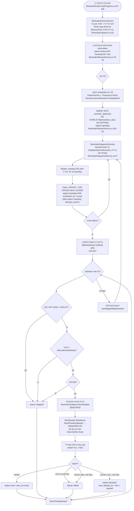

# שירותים חיצוניים ואינטגרציות — Tanakh

> מסמך זה הוא חלק ממיפוי טכני מלא של הפרויקט לקראת עלייה לפרודקשן. הוא מבוסס אך ורק על קריאת הקוד והקבצים בריפו, נכון לתאריך המיפוי (2026-08-07). כל עובדה מגובה בקובץ ושורה. שום דבר כאן אינו המלצה — זהו תיאור עובדתי בלבד. לא בוצע חיבור למסד הנתונים בפועל; כל קביעה על טבלאות/שדות מבוססת על קריאת קוד ה-DbContext/Configuration/Migrations בלבד.

## 1. טבלת שירותים חיצוניים

| שירות | לשם מה משמש | קובץ שבו מוגדר/נקרא | משתנה סביבה שמחזיק את האישורים |
|---|---|---|---|
| **SMS4FREE** (`api.sms4free.co.il`) | שליחת כל הודעות ה-SMS באפליקציה: תזכורות קריאה יומיות (`SmsMessageType.Reminder`), קודי OTP להתחברות מנהל ולהרשמת מנוי (`SmsMessageType.Otp`), והודעת בדיקה מפאנל הניהול (`SmsMessageType.Test`) — `Backend/Tanakh.Domain/Entities/SmsMessageType.cs:1-7`. השליחה בפועל: `Backend/Tanakh.Infrastructure/Services/Sms4FreeSmsSender.cs:46-97` (קריאת `HttpClient.PostAsJsonAsync` לכתובת `options.ApiUrl`, שורה 65). בדיקת יתרה: `Backend/Tanakh.Infrastructure/Services/SmsBalanceService.cs:56-84` (קריאה לכתובת `options.BalanceApiUrl`, שורה 62). רישום ה-`HttpClient` המוקלד: `Backend/Tanakh.Api/Program.cs:159-166`. כתובות ברירת המחדל (ניתנות לדריסה בקונפיג): `Backend/Tanakh.Infrastructure/Options/SmsOptions.cs:25,29`. | `Sms__Key`, `Sms__User`, `Sms__Pass` — מוגדרים ב-`Backend/Tanakh.Infrastructure/Options/SmsOptions.cs:10-12`, נקראים כ-`Sms:Key`/`Sms:User`/`Sms:Pass` דרך `Backend/Tanakh.Api/Program.cs:74-75`; מיפוי לשמות משתני הסביבה בפרודקשן (`Sms__Key` וכו') מתועד ב-`Backend/README.md:71-74`. גם `Sms__Sender` (שם/מספר השולח, לא באמת "credential" אך גם לא ערך פומבי) — `SmsOptions.cs:20`, `README.md:74`. ערכים בפועל: `[REDACTED]`. |
| **Hebcal** (`www.hebcal.com`) — API ציבורי ללוח שנה עברי, ללא מפתח | קביעת "האם עכשיו שבת/חג" כדי לחסום שליחת תזכורות בזמן שבת/חג — `Backend/Tanakh.Infrastructure/Services/JewishCalendarService.cs:18-51`. הקריאה ל-API עצמו: `Backend/Tanakh.Infrastructure/Services/JewishCalendarService.cs:53-59` (כתובת קשיחה בקוד, כולל `geonameid=293397` קבוע — ירושלים). | אין (API ציבורי ללא מפתח/סוד — לא נמצא משתנה סביבה או קונפיג עבורו; הכתובת קשיחה בקוד עצמו, לא בקובץ קונפיגורציה). |
| **Google Fonts** (`fonts.googleapis.com`) | טעינת גופנים לממשק הפרונטאנד (Rubik, Frank Ruhl Libre, Material Icons) | `Frontend/src/index.html:27-28` (תגי `<link>` ישירים ב-HTML) | אין (משאב סטטי ציבורי, ללא אישורים). |
| **PostgreSQL** (מסד הנתונים של האפליקציה; לפי `Backend/README.md:84` היעד בפרודקשן הוא Neon) | מסד הנתונים הראשי של כל השירות — נקרא/נכתב על ידי `AppDbContext` בכל שכבות השירות | חיבור עיקרי (runtime, pooled): `Backend/Tanakh.Api/Program.cs:35-45` (`builder.Configuration.GetConnectionString("AppDb")`). חיבור נפרד למיגרציות/seed (הרשאות גבוהות יותר): `Backend/Tanakh.Infrastructure/Data/AppDbContextFactory.cs:16-18`, `Backend/Tanakh.Infrastructure/Seeding/DatabaseSeeder.cs:28-29`. | `ConnectionStrings__AppDb` (זמן ריצה) ו-`ConnectionStrings__MigrationsDb` (מיגרציות/seed בלבד) — ראו `Backend/Tanakh.Infrastructure/Data/AppDbContextFactory.cs:9,16`, `Backend/README.md:89`. ערכים בפועל: `[REDACTED]`. |

לא נמצאו בקוד: ספק אימייל, ספק אחסון קבצים (file storage) חיצוני, ספק תשלומים, כלי אנליטיקס (Google Analytics/Sentry/Mixpanel וכו'), או ספק אימות/Auth חיצוני (OAuth/SSO) — האימות היחיד שקיים הוא Cookie Auth מקומי + OTP דרך SMS4FREE (`Backend/Tanakh.Api/Program.cs:84-106`). ראו גם `Backend/README.md:6-7`: "email is no longer used for anything, reminders or otherwise". חיפוש מפורש אחר מילות מפתח כמו `smtp/sendgrid/mailgun/stripe/paypal/s3/blobstorage/sentry/analytics/oauth` בכל קבצי ה-`.cs` תחת `Backend` לא החזיר תוצאות.

## 2. עבודות רקע/מתזמנים פנימיים (Backend)

בפרויקט אין ספריית תזמון חיצונית (לא Quartz.NET ולא Hangfire) — אומת מול קובצי ה-`.csproj`: `Backend/Tanakh.Api/Tanakh.Api.csproj`, `Backend/Tanakh.Domain/Tanakh.Domain.csproj`, `Backend/Tanakh.Infrastructure/Tanakh.Infrastructure.csproj` (רשימת `PackageReference` מלאה נבדקה — אין הפניה לחבילות תזמון/תור עבודה). כל מנגנוני הרקע הם מחלקות `BackgroundService` מובנות של .NET, הרשומות ב-`Backend/Tanakh.Api/Program.cs:156-158`:

| שירות | קובץ | תיאור קצר |
|---|---|---|
| `RetentionHostedService` | `Backend/Tanakh.Infrastructure/Retention/RetentionHostedService.cs:23-146` | לולאת `PeriodicTimer` (שורה 41) הרצה כל `RetentionOptions.RunInterval` (ברירת מחדל 24 שעות — `Backend/Tanakh.Infrastructure/Options/RetentionOptions.cs:17`), מוחקת שורות `reminder_deliveries` ישנות ומאנונימזת מנויים שבוטלו — פירוט בסעיף 4. |
| `ReminderPlannerService` | `Backend/Tanakh.Infrastructure/Reminders/ReminderPlannerService.cs:24-136` | יוצר שורות `reminder_deliveries` עתידיות למנויים פעילים — פירוט מלא בסעיף 3. |
| `ReminderDispatcherService` | `Backend/Tanakh.Infrastructure/Reminders/ReminderDispatcherService.cs:27-234` | סוקר (poll) שורות `reminder_deliveries` שהגיע זמנן ושולח אותן ב-SMS — פירוט מלא בסעיף 3. |

שלושתן רשומות כ-`IHostedService` (`AddHostedService<T>`) בתוך תהליך ה-API עצמו — אין תהליך worker נפרד. החלטה זו מתועדת ומנומקת ב-`docs/adr/002-worker-hosting.md:1-8,15-19`.

## 3. שירות התזכורות (Reminder Service) — ניתוח מעמיק

### 3.a קבצים שמממשים את השירות

- `Backend/Tanakh.Infrastructure/Reminders/ReminderPlannerService.cs` — יוצר את שורות ה-outbox (`reminder_deliveries`) מראש.
- `Backend/Tanakh.Infrastructure/Reminders/ReminderDispatcherService.cs` — סוקר את ה-outbox ושולח בפועל.
- `Backend/Tanakh.Domain/Scheduling/NextOccurrenceResolver.cs` — מחשב "מתי מופע הבא של שעה מועדפת מקומית".
- `Backend/Tanakh.Domain/Scheduling/LocalTimeResolver.cs` — ממיר שעת קיר מקומית ל-`DateTimeOffset` תוך טיפול ב-DST (קפיצת/חזרת שעון).
- `Backend/Tanakh.Domain/Entities/ReminderDelivery.cs` — ישות ה-outbox (שורה אחת לכל שילוב מנוי+מועד שליחה).
- `Backend/Tanakh.Infrastructure/Data/Configurations/ReminderDeliveryConfiguration.cs` — מיפוי ה-Entity לטבלת `reminder_deliveries` (אינדקסים, unique constraints, check constraint).
- `Backend/Tanakh.Infrastructure/Options/RemindersOptions.cs` — כל פרמטרי הקונפיגורציה (cron, מרווחים, תבנית הודעה וכו').
- `Backend/Tanakh.Domain/ISmsSender.cs` + `Backend/Tanakh.Infrastructure/Services/Sms4FreeSmsSender.cs` — ביצוע השליחה בפועל מול SMS4FREE.
- `Backend/Tanakh.Domain/Sms/SmsSegmentCalculator.cs` — חישוב מספר מקטעי ה-SMS שיחויבו.
- `Backend/Tanakh.Infrastructure/Services/JewishCalendarService.cs` + `Backend/Tanakh.Infrastructure/Services/IJewishCalendarService.cs` — קביעת חסימת שבת/חג.
- `Backend/Tanakh.Domain/Entities/Subscriber.cs` — ישות המנוי (שעה מועדפת, אזור זמן, סטטוס וכו').

### 3.b מה מפעיל את השירות

השירות מופעל כ-`BackgroundService` בתוך תהליך ה-API עצמו — לא Cron חיצוני, לא DB Trigger, ולא קריאת API מבחוץ. הרישום נעשה ב-`Backend/Tanakh.Api/Program.cs:157-158`:

```
builder.Services.AddHostedService<ReminderPlannerService>();
builder.Services.AddHostedService<ReminderDispatcherService>();
```

יש שני "מפעילים" נפרדים בתוך אותו BackgroundService-set:

1. **המתזמן (Planner)** — `ReminderPlannerService.ExecuteAsync` (`Backend/Tanakh.Infrastructure/Reminders/ReminderPlannerService.cs:40-66`) רץ **מיד עם עליית התהליך** (שורה 42: `await RunPlanningCycleAsync(...)` לפני הלולאה), ולאחר מכן נכנס ללולאה שמחשבת מתי המופע הבא של `PlannerCron` צריך לרוץ ומחכה לו (`Task.Delay`, שורות 47-65). כלומר אין ספריית Cron אמיתית — יש `Task.Delay` עד לזמן היעד המחושב.
2. **המפיץ (Dispatcher)** — `ReminderDispatcherService.ExecuteAsync` (`Backend/Tanakh.Infrastructure/Reminders/ReminderDispatcherService.cs:45-61`) רץ בלולאת `PeriodicTimer` על בסיס `options.DispatchIntervalSeconds` (שורה 47).

### 3.c לוח זמנים מדויק ואזור זמן

**המתזמן (Planner):**
- ברירת המחדל של `RemindersOptions.PlannerCron` היא `"5 0 * * *"` — `Backend/Tanakh.Infrastructure/Options/RemindersOptions.cs:10`, עם הערה בקוד "00:05 Israel time by default" (שורה 9). בעברית: **כל יום בשעה 00:05**.
- הפרסור של הביטוי מוגבל בכוונה לתבנית יומית קבועה `"minute hour * * *"` בלבד — `ParseDailyCronTime` זורק שגיאה על כל תבנית אחרת (`Backend/Tanakh.Infrastructure/Reminders/ReminderPlannerService.cs:121-131`). זו לא ספריית Cron כללית.
- אזור הזמן של הרצת המתזמן עצמו נלקח מ-`RemindersOptions.DefaultTimezone`, ברירת מחדל `"Asia/Jerusalem"` — `Backend/Tanakh.Infrastructure/Options/RemindersOptions.cs:24`, ומיושם ב-`ComputeNextRun` (`ReminderPlannerService.cs:133-134`) דרך `TimeZoneInfo.FindSystemTimeZoneById`.
- ה-DST (מעבר שעון קיץ/חורף בישראל) מטופל במפורש: `Backend/Tanakh.Domain/Scheduling/LocalTimeResolver.cs:9` — הערת קוד: "Israel alternates IST (UTC+2) / IDT (UTC+3); a fixed offset would send reminders an hour off for half the year, so every conversion goes through TimeZoneInfo against the actual date". הטיפול בפועל: פער קפיצת שעון קדימה (spring-forward gap) מתקדם לרגע התקף הראשון (`LocalTimeResolver.cs:15-19,44-60`); חפיפת חזרת שעון (fall-back) בוחר במופע הראשון/שעון-הקיץ (`LocalTimeResolver.cs:23-39`).

**המפיץ (Dispatcher):**
- רץ כל `DispatchIntervalSeconds`, ברירת מחדל **60 שניות** — `Backend/Tanakh.Infrastructure/Options/RemindersOptions.cs:12`, מיושם ב-`ReminderDispatcherService.cs:47` (`PeriodicTimer`).
- כל שעת שליחה בפועל למנוי בודד היא **השעה המועדפת האישית של אותו מנוי** (`Subscriber.PreferredTime`, `Backend/Tanakh.Domain/Entities/Subscriber.cs:20`) באזור הזמן האישי שלו (`Subscriber.Timezone`, ברירת מחדל `"Asia/Jerusalem"` — שורה 22), ולא שעה גלובלית אחת לכולם. החישוב: `NextOccurrenceResolver.ComputeNext` (`Backend/Tanakh.Domain/Scheduling/NextOccurrenceResolver.cs:11-23`), הנקרא מ-`ReminderPlannerService.cs:99-100`.
- מקור נוסף לתלות זמן: `LocalTimeResolverTests.cs` (`Backend/Tanakh.Tests/LocalTimeResolverTests.cs`) — קובץ בדיקות היחידה עבור `LocalTimeResolver`, מאמת את התנהגות ה-DST המתוארת לעיל.

### 3.d תיאור זרימת הבקרה, שלב-אחר-שלב

**מחזור תכנון (Planner) — `RunPlanningCycleAsync`, `ReminderPlannerService.cs:68-119`:**
1. פותח `IServiceScope` חדש ושואב `AppDbContext` (שורות 70-71).
2. שולף מטבלת `subscribers` את כל המנויים הפעילים: `Status == Active` וגם (`PausedUntil == null` או `PausedUntil` כבר עבר) — שורות 73-76.
3. עבור כל מנוי: מנסה לפענח את `Subscriber.Timezone` ל-`TimeZoneInfo`; אם אזור הזמן לא תקין — מדלג עם `LogWarning` (שורות 82-93).
4. מחשב את זמן השליחה הבא (`scheduledFor`) עבור אותו מנוי דרך `NextOccurrenceResolver.ComputeNext` (שורות 99-100) — היום אם השעה המועדפת עוד לא עברה, אחרת מחר.
5. מחשב `idempotencyKey` דטרמיניסטי מ-SHA256 על `subscriberId:scheduledFor` (`ReminderDelivery.ComputeIdempotencyKey`, `Backend/Tanakh.Domain/Entities/ReminderDelivery.cs:60-65`), כדי שריצה חוזרת של המתזמן לא תיצור כפילות.
6. מבצע `INSERT INTO reminder_deliveries (...) VALUES (...) ON CONFLICT (idempotency_key) DO NOTHING` גולמי (`ExecuteSqlInterpolatedAsync`, שורות 105-111) — לא "בדוק ואז הכנס", אלא הכנסה אטומית שלא יכולה להתחרות בעצמה גם כשכמה מופעי API רצים במקביל.
7. רושם ללוג כמה שורות הוכנסו מתוך סך המנויים הפעילים (שורות 116-118).
8. ריצה ראשונה מיידית עם עליית התהליך (שחזור מהשבתה), ולאחריה ריצה יומית לפי הלו"ז שבסעיף 3.c (שורות 40-65).

**מחזור שליחה (Dispatcher) — `RunDispatchCycleAsync`, `ReminderDispatcherService.cs:63-112`:**
1. פותח `IServiceScope`, שואב `AppDbContext`, `ISmsSender` ו-`IJewishCalendarService` (שורות 65-68).
2. **"reaper"**: מעדכן שורות שנתקעו במצב `sending` יותר מ-10 דקות (`SendingReaperThreshold`, שורה 29) בחזרה ל-`pending` — `ReapStuckSendingRowsAsync` (שורות 205-212) — שחזור ממקרה של קריסה באמצע שליחה.
3. **תפיסת שורות (claim)**: `ClaimDueDeliveriesAsync` (שורות 214-232) — שאילתת `UPDATE ... FROM (SELECT ... WHERE status='pending' AND scheduled_for<=now() AND (next_attempt_at IS NULL OR next_attempt_at<=now()) ORDER BY scheduled_for FOR UPDATE SKIP LOCKED LIMIT {BatchSize}) ... RETURNING d.id` — מסמנת אותן `sending`, מגדילה `attempt_count` ב-1, ומחזירה את ה-ID-ים שנתפסו. `FOR UPDATE SKIP LOCKED` מאפשר כמה מופעי API להריץ את הדיספצ'ר במקביל בלי לשלוח כפול (מתועד גם ב-`docs/adr/001-scheduler.md:54-56` וב-`docs/adr/002-worker-hosting.md:22-28`). `BatchSize` ברירת מחדל 100 — `RemindersOptions.cs:16`.
4. אם לא נתפסה אף שורה — יוצא (שורות 73-76).
5. בדיקת שבת/חג **פעם אחת למחזור שלם** (לא לכל שורה בנפרד): `jewishCalendarService.IsBlockedAsync(DateTimeOffset.UtcNow, ...)` (שורה 81) — קורא לשירות Hebcal (סעיף 1).
6. טוען את כל שורות ה-`ReminderDelivery` שנתפסו (שורות 83-85).
7. עבור כל שורה — `ProcessDeliveryAsync` (שורות 116-193, פירוט בסעיף 3.e/3.f/3.h למטה), ואז `SaveChangesAsync` מיידי אחרי כל שורה בודדת (שורה 101).
8. אם השליחה הצליחה ו-`SendRatePerSecond > 0` (ברירת מחדל 10 — `RemindersOptions.cs:22`) — `Task.Delay` לוויסות קצב השליחה (שורות 103-106).
9. רישום סיכום ללוג: כמה נשלחו/דולגו/נכשלו/תוזמנו לניסיון חוזר (שורות 109-111).

### 3.e טבלאות ושדות DB — קריאה וכתיבה (לפי קוד בלבד, ללא גישה ישירה למסד)

**טבלת `subscribers`** (מיפוי ב-`Backend/Tanakh.Infrastructure/Data/Configurations/SubscriberConfiguration.cs:12`, ישות ב-`Backend/Tanakh.Domain/Entities/Subscriber.cs`):
- **קריאה** על ידי המתזמן: `status`, `paused_until` בסינון (`ReminderPlannerService.cs:73-76`); `timezone`, `preferred_time`, `id` לחישוב מועד השליחה (`ReminderPlannerService.cs:82-100`).
- **קריאה** על ידי המפיץ: `id`, `status`, `phone_number`, `display_name` — `ReminderDispatcherService.cs:123-130,148,155`.
- אין כתיבה ל-`subscribers` על ידי שירות התזכורות עצמו (המתזמן/המפיץ קוראים בלבד מטבלה זו).

**טבלת `reminder_deliveries`** (מיפוי ב-`Backend/Tanakh.Infrastructure/Data/Configurations/ReminderDeliveryConfiguration.cs`, שדות מלאים אומתו מול `Backend/Tanakh.Infrastructure/Migrations/AppDbContextModelSnapshot.cs:341-436`):
- **כתיבה (INSERT)** על ידי המתזמן: `id, subscriber_id, scheduled_for, status='pending', attempt_count=0, idempotency_key, created_at=now(), updated_at=now()` — `ReminderPlannerService.cs:105-111`.
- **כתיבה (UPDATE, "reaper")**: `status` (`sending`→`pending`), מסונן לפי `updated_at` — `ReminderDispatcherService.cs:207-211`.
- **כתיבה (UPDATE, claim)**: `status='sending'`, `attempt_count=attempt_count+1`, `updated_at=now()` — `ReminderDispatcherService.cs:217-229`.
- **קריאה**: כל שורות ה-`ReminderDelivery` שנתפסו, לפי `id` — `ReminderDispatcherService.cs:83-85`.
- **כתיבה (עדכון ה-Entity בזיכרון, נשמר ב-`SaveChangesAsync`)** בתוך `ProcessDeliveryAsync`: `target_url`, `message_body`, `segment_count` (שורות 151-153); `provider_response`, `provider_status_code` (שורות 157-158); ואז אחד מהבאים בהתאם לתוצאה: `status='Sent'`+`sent_at=now()` (שורות 162-163), או `status='Skipped'` (שורות 128-129, 135-136, 144-145 — שלושה תרחישי דילוג שונים, ראו 3.d/3.h), או `status='Failed'`+`last_error` (שורות 171-173, 191-192), או `status='Pending'`(ניסיון חוזר)+`next_attempt_at`+`last_error` (שורות 185-187).
- שדה `provider_message_id` **קיים בטבלה** (מיגרציה `Backend/Tanakh.Infrastructure/Migrations/20260730142054_ReminderDeliveries.cs`, `AppDbContextModelSnapshot.cs:376-378`) אך **לא אותר בקוד הנוכחי מקום שממלא אותו** — לא ב-`ReminderDispatcherService.cs` ולא ב-`Sms4FreeSmsSender.cs` (SMS4FREE לא מחזיר מזהה הודעה בתגובה שנקלטת בקוד). ראו סעיף "לא ידוע" בתחתית המסמך.
- אינדקסים/אילוצים רלוונטיים: unique על `idempotency_key` (`ReminderDeliveryConfiguration.cs:50-51`), unique על `(subscriber_id, scheduled_for)` (שורות 47-48), אינדקס על `(status, scheduled_for)` לטובת שאילתת ה"מה מגיע" (שורה 54), ו-check constraint על ערכי `status` (שורה 14).

**טבלת `sms_log`** (מיפוי ב-`Backend/Tanakh.Infrastructure/Data/Configurations/SmsLogConfiguration.cs:12`, ישות ב-`Backend/Tanakh.Domain/Entities/SmsLog.cs`):
- **כתיבה (INSERT)** על ידי `Sms4FreeSmsSender.LogAsync`, בכל קריאת `SendAsync` (כולל תזכורות, OTP והודעת בדיקה): `id, to_phone_number, type, message, success, provider_response, provider_status_code` — `Backend/Tanakh.Infrastructure/Services/Sms4FreeSmsSender.cs:99-123`. זו טבלת לוג שטוחה, נפרדת מ-`reminder_deliveries` (הערת קוד: `SmsLog.cs:6-11`).

### 3.f איך התזכורת נמסרת בפועל

באמצעות **SMS בלבד**, דרך `ISmsSender.SendAsync` (`Backend/Tanakh.Domain/ISmsSender.cs:18-25`), ממומש על ידי `Sms4FreeSmsSender` (`Backend/Tanakh.Infrastructure/Services/Sms4FreeSmsSender.cs:17-137`), הנקרא מ-`ReminderDispatcherService.cs:155`. אין ערוץ אימייל (`Backend/README.md:6-7`), אין push notifications ואין הודעות in-app שנמצאו בקוד עבור תזכורות. אם `SmsOptions.DryRun` הוא `true` (ברירת מחדל, `SmsOptions.cs:36`) — לא מתבצעת קריאת HTTP אמיתית ל-SMS4FREE; המערכת רק רושמת ללוג ולטבלת `sms_log` כאילו נשלח בהצלחה (`Sms4FreeSmsSender.cs:51-59`). לפי `Backend/README.md:18`: "**Must stay `true` in every non-production environment**".

### 3.g היכן ממוקם תוכן/תבנית ההודעה, ותרגום

תבנית ההודעה מוגדרת כברירת מחדל בקונפיגורציה (ולא בקוד בלבד — ניתנת לדריסה) ב-`RemindersOptions.SmsTemplate`:

```
"היי{שם} 😊 הגיע הזמן לפרק התנ\"ך היומי שלך! לחצו להמשיך לקרוא: {קישור} לביטול תזכורות - בהגדרות באתר"
```

(`Backend/Tanakh.Infrastructure/Options/RemindersOptions.cs:33-34`). ההחלפה של הפלייסהולדרים מתבצעת ב-`BuildReminderSms` (`ReminderDispatcherService.cs:196-203`): `{שם}` → רווח + שם התצוגה של המנוי (`subscriber.DisplayName`) או ריק; `{קישור}` → `RemindersOptions.PublicBaseUrl`.

**התבנית קיימת בעברית קשיחה בלבד ואינה מתורגמת/מותאמת לפי שפה.** לישות `Subscriber` יש שדה `Locale` (ברירת מחדל `"he-IL"`, `Backend/Tanakh.Domain/Entities/Subscriber.cs:38`), אך נבדק במפורש בכל קוד ה-Backend — השדה הזה **לא נקרא בשום מקום** מלבד מיפוי ה-EF Core שלו (`Backend/Tanakh.Infrastructure/Data/Configurations/SubscriberConfiguration.cs:53`). כלומר אין מנגנון בפועל שבוחר תבנית הודעה שונה לפי `Locale`.

### 3.h טיפול בכשלים

**ניסיונות חוזרים (retry):**
- `RemindersOptions.MaxAttempts` — ברירת מחדל 3 (`RemindersOptions.cs:18`).
- `RemindersOptions.RetryBackoffMinutes` — ברירת מחדל `[1, 5, 25]` דקות (`RemindersOptions.cs:20`), נבחר לפי `attempt_count` הנוכחי (`ReminderDispatcherService.cs:176-183`).
- כשל **זמני** (לא בקודי הכשל הקבועים) ו-`AttemptCount < MaxAttempts` → הסטטוס חוזר ל-`Pending` עם `next_attempt_at` עתידי, כדי שהדיספצ'ר ינסה שוב במחזור עתידי (`ReminderDispatcherService.cs:176-189`).
- כשל **קבוע** (קודי SMS4FREE `-3` "no recipients found" או `-5` "message rejected", `PermanentFailureCodes` ב-`Sms4FreeSmsSender.cs:29`) → הסטטוס עובר ישירות ל-`Failed`, ללא ניסיון חוזר (`ReminderDispatcherService.cs:169-174`) — הערת קוד: "retrying the same request produces the same result".
- מיצוי כל הניסיונות → `Failed` (`ReminderDispatcherService.cs:191-193`).

**חלון "איחור מותר" (lateness):** אם `now - scheduled_for > MaxLatenessMinutes` (ברירת מחדל 60 דקות, `RemindersOptions.cs:14`) — השורה מדולגת (`Skipped`) ולא נשלחת באיחור רב (`ReminderDispatcherService.cs:133-137`).

**חסימת שבת/חג:** אם `IsBlockedAsync` מחזיר `true` — כל השורות שנתפסו באותו מחזור מדולגות (`Skipped`), **ללא תלות** בהעדפת המנוי `SkipShabbatHolidays` (הערת קוד מפורשת ב-`ReminderDispatcherService.cs:139-141`: "Hard block, unconditional - not gated on subscriber.SkipShabbatHolidays. Blocked deliveries are skipped outright, never queued for after Shabbat/Yom Tov"). כלומר בקוד הנוכחי, שורות שנחסמו כך **לא** מתוזמנות מחדש לאחר צאת השבת/החג — הן מדולגות סופית.

**מנוי לא תקין:** אם המנוי לא נמצא, לא `Active`, או ללא `PhoneNumber` — `Skipped` (`ReminderDispatcherService.cs:126-130`).

**כשל תעבורתי (timeout/רשת):** נתפס ב-`Sms4FreeSmsSender.cs:90-96` (`HttpRequestException`/`TaskCanceledException`), מוחזר כ-`Success=false, StatusCode=0` — נכנס לזרם ה-retry הרגיל (לא כשל קבוע).

**מצב/סטטוס על רשומת ה-DB:** שדה `status` על `reminder_deliveries` הוא מכונת מצבים מפורשת עם 5 ערכים: `pending → sending → sent / failed / skipped`, אכופה ברמת ה-DB באמצעות check constraint (`ReminderDeliveryConfiguration.cs:14`, `ck_reminder_deliveries_status`). שדה `last_error` שומר את תיאור הכשל האחרון (טקסט חופשי, למשל `"SMS4FREE status {code} (permanent)."` — `ReminderDispatcherService.cs:172`).

**מה נרשם ללוג:** `logger.LogInformation`/`LogWarning`/`LogError`/`LogCritical` במספר נקודות — סיכום כל מחזור תכנון (`ReminderPlannerService.cs:116-118`), סיכום כל מחזור שליחה (`ReminderDispatcherService.cs:109-111`), כשל שלם של מחזור שליחה (`ReminderDispatcherService.cs:55-57`), כשל שליחת SMS בודדת עם רמת חומרה לפי קוד הסטטוס — `Critical` לקודי חשבון (`-1,-2,-4,-6`), `Warning` לשאר (`Sms4FreeSmsSender.cs:75-84`), וכשל תעבורתי (`Sms4FreeSmsSender.cs:92`). בנוסף — כל שליחת SMS (כולל תזכורות) נרשמת כשורה בטבלת `sms_log` ללא קשר להצלחה/כישלון (`Sms4FreeSmsSender.cs:99-123`), ומספקת רישום ביקורת עצמאי מ-`reminder_deliveries`.

### 3.i דיאגרמת זרימה



### 3.j הפעלה ידנית לצורך בדיקה

- **לא אותרה** נקודת קצה (endpoint) ב-`Backend/Tanakh.Api/Controllers/AdminSystemController.cs` או בכל controller אחר שמפעילה ידנית את מחזור התכנון (`ReminderPlannerService`) או מחזור השליחה (`ReminderDispatcherService`) של תזכורת ספציפית. נבדק במפורש: `AdminSystemController.cs` (שלם, שורות 1-168) מכיל רק endpoints לבריאות מערכת, מצב תחזוקה, באנר ו-feature flags — אין שום הפניה למילה "reminder"/"תזכורת".
- הדרך הקרובה ביותר שנמצאה בקוד לבדיקה ידנית של צינור ה-SMS (לא של לוגיקת התזכורות/המתזמן עצמם) היא נקודת הקצה `POST /api/v1/admin/sms/test` — `Backend/Tanakh.Api/Controllers/AdminSmsController.cs:73-78`, המפעילה `IAdminService.SendTestSmsAsync` (`Backend/Tanakh.Infrastructure/Services/AdminService.cs:287-294`), ששולחת הודעת בדיקה קבועה ("הודעת בדיקה ממערכת הניהול") למספר הטלפון המוגדר של המנהל (`AdminOptions.Phone`) דרך אותו `ISmsSender`/SMS4FREE ששירות התזכורות משתמש בו — אך היא **אינה** יוצרת או מעבדת שורת `reminder_deliveries`, ואינה מפעילה את `ReminderPlannerService`/`ReminderDispatcherService`.
- דרך נוספת לבדיקה (לא endpoint אלא הגדרת קונפיגורציה): `Sms:DryRun=false` בסביבת פיתוח, יחד עם המתנה למחזורי ה-Planner/Dispatcher הרגילים — מאפשרת לראות שליחה אמיתית בלי לבנות מנגנון טריגר ייעודי. אין כלי CLI/פקודת `dotnet run --` ייעודית לתזכורות (בניגוד ל-`--seed`/`--reset-db`/`--hash-admin-password` שכן קיימות, `Backend/Tanakh.Api/Program.cs:186-221`).

## 4. שירותי רקע נוספים (מעבר לתזכורות)

### 4.1 ניקוי/שימור נתונים — `RetentionHostedService`

- **קבצים**: `Backend/Tanakh.Infrastructure/Retention/RetentionHostedService.cs`, `Backend/Tanakh.Infrastructure/Options/RetentionOptions.cs`, `Backend/Tanakh.Infrastructure/Services/ISubscriberAnonymizationService.cs`/`SubscriberAnonymizationService.cs`.
- **טריגר**: נרשם כ-`IHostedService` ב-`Backend/Tanakh.Api/Program.cs:156`. לולאת `PeriodicTimer` פנימית (`RetentionHostedService.cs:41`).
- **לו"ז**: כל `RetentionOptions.RunInterval`, ברירת מחדל **24 שעות** (`Backend/Tanakh.Infrastructure/Options/RetentionOptions.cs:17`) — אין שעת יום קבועה, רק מרווח מתמשך מרגע עליית התהליך.
- **מה עושה**:
  1. מוחק בבאצ'ים (`BatchSize` ברירת מחדל 5000, `RetentionOptions.cs:21`) שורות מ-`reminder_deliveries` שה-`created_at` שלהן ישן מ-`ReminderDeliveriesRetentionDays` (ברירת מחדל 90 יום, `RetentionOptions.cs:12`) — `RetentionHostedService.cs:64-72`.
  2. מאתר מנויים ב-`subscribers` עם `status=Unsubscribed`, `unsubscribed_at` לא ריק וישן מ-`UnsubscribedSubscriberRetentionMonths` (ברירת מחדל 12 חודשים, `RetentionOptions.cs:14`), ו-`phone_number` עדיין לא ריק (סימן שטרם אונונם) — קורא ל-`ISubscriberAnonymizationService.AnonymizeAsync` עבור כל אחד (`RetentionHostedService.cs:100-139`).
- **טיפול בכשלים**: `try/catch` סביב כל מחזור שלם — כשל נרשם ב-`LogError` ("will retry on the next scheduled run") ולא מפיל את התהליך (`RetentionHostedService.cs:45-54`). כל מחזור מדווח ל-log כמות שורות שנמחקו/אונונמו ומשך הריצה (`RetentionHostedService.cs:95-97,141-143`). אין שדה סטטוס ב-DB שעוקב אחר ריצות ה-retention עצמן (בניגוד ל-`reminder_deliveries.status`).

### 4.2 בדיקת בריאות נתוני התנ"ך — `TanakhDataHealthCheck`

- **קובץ**: `Backend/Tanakh.Infrastructure/HealthChecks/TanakhDataHealthCheck.cs`.
- **טריגר**: לא BackgroundService — זהו `IHealthCheck` הנרשם ב-`Backend/Tanakh.Api/Program.cs:167-168` (`AddHealthChecks().AddCheck<TanakhDataHealthCheck>("tanakh-data", tags: ["ready"])`) ומופעל **על פי דרישה**, כל אימות HTTP ל-`/health/ready` (`Program.cs:306-309`) — לא רץ ברקע בלולאה עצמאית.
- **מה עושה**: בודק אם קבצי נתוני התנ"ך קיימים על הדיסק דרך `CacheProvider.DataFilesExist()` (`TanakhDataHealthCheck.cs:20`) ומחזיר `Healthy`/`Unhealthy` (ללא חשיפת נתיבי קבצים בתשובה, לפי הערת קוד בשורה 18-19).
- **הערה**: לפי הערה מפורשת ב-`Program.cs:300-305`, בדיקת `/health/ready` **אינה** כוללת בדיקת SMS4FREE — כי שליחת תזכורות היא אסינכרונית דרך הדיספצ'ר, כך שספק SMS למטה לא הופך את המופע ללא-זמין לשרת בקשות.

## לא ידוע / דורש אימות

- **`reminder_deliveries.provider_message_id`**: העמודה קיימת בסכימה (`Backend/Tanakh.Infrastructure/Migrations/AppDbContextModelSnapshot.cs:376-378`, הישות `Backend/Tanakh.Domain/Entities/ReminderDelivery.cs:23`), אך חיפוש מפורש בכל קוד ה-Backend (`ReminderDispatcherService.cs`, `Sms4FreeSmsSender.cs`) לא מצא מקום שכותב לה ערך. לא ברור אם זהו שדה שיועד לשימוש עתידי, שדה שהוסר ממנו שימוש, או שדה שממתין לתמיכה עתידית ב-response format אחר של SMS4FREE. תגובת ה-JSON של SMS4FREE שנקלטת בקוד (`Sms4FreeSmsSender.cs:133-135`, רשומת `Sms4FreeResponse`) מכילה רק `status`/`message` — לא שדה message-id.
- **כתובות ה-API של SMS4FREE** (`Sms:ApiUrl`, `Sms:BalanceApiUrl`) מסומנות בקוד עצמו כ-`TODO(LAUNCH)` לאימות מול חשבון ה-SMS4FREE בפועל לפני עלייה לפרודקשן (`Backend/Tanakh.Infrastructure/Options/SmsOptions.cs:22-24,27-28`) — לא ניתן לאמת מהריפו בלבד אם הכתובות עדיין נכונות.
- **אכיפת `Sms:DryRun=true` בסביבות שאינן production ברמת קוד (לא רק כמוסכמה)**: התיעוד ב-`Backend/README.md:18` וב-`docs/adr/001-scheduler.md` (הקשר תיאורי, לא הקובץ הזה עצמו) מרמזים ש"Must stay true... enforced at startup, not just by convention" (ניסוח בהערת קוד ב-`SmsOptions.cs:33-36` מדבר על "אין sandbox... DryRun חייב להיות true בכל סביבה שאינה פרודקשן"), אך חיפוש מפורש אחר `IValidateOptions`/`ValidateOnStart`/ולידציה דומה ב-`Backend/Tanakh.Api/Program.cs` ובכל קובץ `.cs` תחת `Backend` לא העלה קוד אכיפה בפועל בזמן עליית התהליך. ייתכן שהאכיפה קיימת ברמת התהליך/CI/משתני סביבה של הפריסה ולא בקוד עצמו — לא אומת.
- **מדוע חסימת שבת/חג אינה מתוזמנת מחדש**: הקוד מדלג סופית (`Skipped`) על שורות שנחסמו עקב שבת/חג, ללא לוגיקת "נסה שוב אחרי הבדלה/מוצאי חג" (`ReminderDispatcherService.cs:139-146`). לא נמצא בקוד (Backend או ADR) הסבר לכוונת המוצר מאחורי החלטה זו — מתועד כאן כעובדה על ההתנהגות בפועל, לא כהערכה.
- **`SmsOptions.Sender`**: התיעוד בקוד (`SmsOptions.cs:14-20`) מציין שזהו כרגע מספר הטלפון הרשום (מגבלת חשבון ניסיון של SMS4FREE) וש"switch likely needs its own sender-verification step" — לא נבדק/אומת מול חשבון SMS4FREE בפועל אם/מתי בוצע המעבר, כי זהו ערך קונפיגורציה (`[REDACTED]`) ולא קוד.
